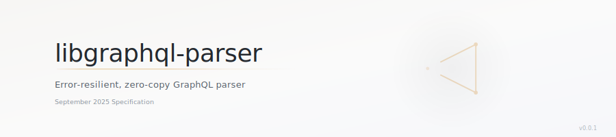
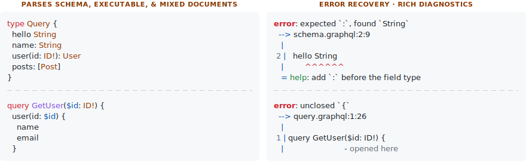

<p align="center">
  <picture>
    <source media="(prefers-color-scheme: dark)" srcset="assets/readme-banner-dark.svg" />
    <source media="(prefers-color-scheme: light)" srcset="assets/readme-banner-light.svg" />
    
  </picture>
</p>

<p align="center">
  <a href="https://crates.io/crates/libgraphql-parser"></a>
  <a href="https://docs.rs/libgraphql-parser/"></a>
  <a href="https://github.com/jeffmo/libgraphql/blob/main/LICENSE"></a>
  
</p>

<picture>
  <source media="(prefers-color-scheme: dark)" srcset="assets/readme-code-dark.svg" />
  <source media="(prefers-color-scheme: light)" srcset="assets/readme-code-light.svg" />
  
</picture>

## Features

- **Error-resilient parsing** — produces a partial AST alongside a list of
  errors, even when the input is malformed. Never panics.
- **Rust-inspired error diagnostic output** — error messages with source
  snippets, span highlighting, contextual notes, and fix suggestions.
- **Zero-copy lexing** — uses `Cow<'src, str>` to avoid allocations for
  tokens that match the source verbatim.
- **Schema, executable, and mixed documents** — parses type definitions,
  operations/fragments, or documents containing both interleaved together.
- **[September 2025](https://spec.graphql.org/September2025/) GraphQL
  specification** compliance.
- **Dual column tracking** — reports both UTF-8 character positions (for
  display) and UTF-16 code unit positions (for LSP integration).
- **Comment/trivia preservation** — captures comments as trivia attached to
  following tokens.
- **Generic over token sources** — the parser works with any
  `GraphQLTokenSource` (string input, proc-macro token streams, etc.).
- **Configurable AST access** — `valid_ast()` for strict consumers that
  require error-free input, `ast()` for best-effort tooling (IDEs, linters,
  formatters).
- **Fuzz-tested at scale** — 25M+ `libfuzzer` executions across 4 fuzz
  targets, zero crashes.

## Getting Started

```bash
cargo add libgraphql-parser
```

Or add this to your `Cargo.toml`:
```toml
[dependencies]
libgraphql-parser = "0.0.1"
```

## Usage

Parse a GraphQL schema document:

```rust
use libgraphql_parser::GraphQLParser;

let result = GraphQLParser::new("type Query { hello: String }")
    .parse_schema_document();

assert!(!result.has_errors());
let doc = result.valid_ast().unwrap();
```

Parse an executable document (queries, mutations, subscriptions):

```rust
use libgraphql_parser::GraphQLParser;

let result = GraphQLParser::new("{ user { name email } }")
    .parse_executable_document();

assert!(!result.has_errors());
```

### Error Recovery

Unlike many GraphQL parsers that stop at the first error,
`libgraphql-parser` collects multiple errors and still produces a
best-effort AST. This is essential for IDE integration, linters, and
formatters:

```rust
use libgraphql_parser::GraphQLParser;

// This schema has errors: missing `:` on field type, unclosed brace
let source = "type Query { hello String";
let result = GraphQLParser::new(source).parse_schema_document();

// Errors are collected — inspect them all at once
assert!(result.has_errors());
for error in &result.errors {
    eprintln!("{}", error.format_detailed(Some(source)));
}

// A partial AST is still available for best-effort tooling
if let Some(doc) = result.ast() {
    // IDE completions, formatting, linting can still work
    // on the partially-parsed document
    println!("Parsed {} definitions", doc.definitions.len());
}
```

### Diagnostic Output

Error messages include source spans, contextual notes, and fix
suggestions — inspired by the Rust compiler's diagnostic style:

```text
error: unknown directive location `FIELD_DEFINTION`
  --> <input>:1:42
   |
 1 | directive @deprecated(reason: String) on FIELD_DEFINTION | ENUM_VALUE
   |                                          ^^^^^^^^^^^^^^^
   = help: did you mean `FIELD_DEFINITION`?
```

Unclosed delimiters point back to the opening location:

```text
error: unclosed `{`
  --> <input>:9:2
   |
 9 | }
   |  ^
   = note: opening `{` in selection set here
      1 | query {
        |       -
```

### Strict vs. Best-Effort AST Access

`ParseResult` offers two modes for accessing the AST:

```rust
use libgraphql_parser::GraphQLParser;

let source = "type Query { hello: String }";
let result = GraphQLParser::new(source).parse_schema_document();

// Strict mode: returns AST only if there were zero errors.
// Use this when compiling schemas or executing queries.
if let Some(doc) = result.valid_ast() {
    // Guaranteed: no parse errors
}

// Best-effort mode: returns AST if present, even with errors.
// Use this for IDE features, formatters, and linters.
if let Some(doc) = result.ast() {
    // May be a partial/recovered AST — check result.has_errors()
}
```

## Design Goals

- **Performance** — zero-copy lexing via `Cow<'src, str>`, minimal
  allocations (e.g., `SmallVec` for trivia), and hand-written recursive
  descent parsing.
- **Error resilience** — always produce as much AST as possible, collecting
  all errors in a single pass rather than stopping at the first failure.
- **Spec correctness** — targets the
  [September 2025](https://spec.graphql.org/September2025/) GraphQL
  specification.
- **Extensible architecture** — the parser is generic over
  `GraphQLTokenSource`, enabling the same parsing logic to work across
  string input, proc-macro token streams, and other token sources.
- **Tooling-ready** — designed for IDE integration, linters, formatters,
  and compiler frontends with dual UTF-8/UTF-16 position tracking and
  configurable AST access.

## Comparison to Alternatives

|                        | `libgraphql-parser`     | `graphql-parser` | `apollo-parser`        | `cynic-parser`     | `async-graphql-parser`              |
|------------------------|-------------------------|------------------|------------------------|--------------------|-------------------------------------|
| **Spec version**       | Sep 2025                | Oct 2016         | Oct 2021               | Oct 2021           | Oct 2021                            |
| **Error recovery**     | ✅ Partial AST + errors  | ❌ Fail-fast     | ✅ Full CST + errors    | ✅ Multiple errors  | ❌ Fail-fast                         |
| **Zero-copy lexing**   | ✅ `Cow<'src, str>`      | ❌               | ❌                     | ❌                 | ❌                                   |
| **Output type**        | AST                     | AST              | Lossless CST           | AST (arena)        | AST                                 |
| **Mixed documents**    | ✅                       | ❌               | ❌                     | ❌                 | ❌                                   |
| **Standalone**         | ✅                       | ✅               | ✅                     | ✅                 | ❌ (needs `async-graphql-value`)     |
| **LSP positions**      | ✅ UTF-8 + UTF-16       | ❌               | ❌                     | ❌                 | ❌                                   |
| **Trivia preserved**   | ✅ Comments              | ❌               | ✅ All whitespace       | ❌                 | ❌                                   |
| **Fuzz tested**        | ✅ 25M+ runs             | ❌               | ✅                     | ❌                 | ✅                                   |

## Performance

Performance is a first-class design goal. The lexer avoids allocations via
`Cow<'src, str>` (borrowing directly from the source string for tokens that
don't need transformation) and uses `SmallVec` for trivia storage and
token-buffering. The parser itself is a hand-written recursive descent
parser, avoiding the overhead of parser generator runtimes and allowing for
more helpful and structured error information, notes, and possible-fix
suggestions.

<!-- TODO: Fill in criterion benchmark results before publishing -->
Benchmarks comparing against other Rust GraphQL parsers are coming soon.

## Core Types

| Type                      | Description                                                                                                                         |
|---------------------------|-------------------------------------------------------------------------------------------------------------------------------------|
| [`GraphQLParser<S>`]      | Generic recursive-descent parser. Entry points: `parse_schema_document()`, `parse_executable_document()`, `parse_mixed_document()`. |
| [`ParseResult<T>`]        | Result type holding both a (possibly partial) AST and accumulated errors.                                                           |
| [`StrGraphQLTokenSource`] | Zero-copy lexer producing `GraphQLToken` streams from `&str` input.                                                                 |
| [`GraphQLParseError`]     | Parse error with message, source span, categorized kind, and contextual notes.                                                      |
| [`GraphQLTokenSource`]    | Trait for pluggable token sources (string input, proc-macro tokens, etc.).                                                          |

[`GraphQLParser<S>`]: https://docs.rs/libgraphql-parser/latest/libgraphql_parser/struct.GraphQLParser.html
[`ParseResult<T>`]: https://docs.rs/libgraphql-parser/latest/libgraphql_parser/struct.ParseResult.html
[`StrGraphQLTokenSource`]: https://docs.rs/libgraphql-parser/latest/libgraphql_parser/token_source/struct.StrGraphQLTokenSource.html
[`GraphQLParseError`]: https://docs.rs/libgraphql-parser/latest/libgraphql_parser/struct.GraphQLParseError.html
[`GraphQLTokenSource`]: https://docs.rs/libgraphql-parser/latest/libgraphql_parser/token_source/trait.GraphQLTokenSource.html

## Part of the `libgraphql` Ecosystem

`libgraphql-parser` is the parsing foundation of the
[`libgraphql`](https://crates.io/crates/libgraphql) project — a
comprehensive GraphQL engine library for building tools, clients, and
servers in Rust. It is used by `libgraphql-core` for schema building,
operation validation, and type system logic.

## Running Tests

```bash
cargo test --package libgraphql-parser
```

## Fuzz Testing

The crate includes a [`cargo-fuzz`](https://github.com/rust-fuzz/cargo-fuzz)
setup under `fuzz/` with four targets:

| Target                  | Entry point                                      |
|-------------------------|--------------------------------------------------|
| `fuzz_lexer`            | `StrGraphQLTokenSource` (full token iteration)   |
| `fuzz_parse_schema`     | `GraphQLParser::parse_schema_document()`         |
| `fuzz_parse_executable` | `GraphQLParser::parse_executable_document()`     |
| `fuzz_parse_mixed`      | `GraphQLParser::parse_mixed_document()`          |

### Prerequisites

```bash
rustup toolchain install nightly
cargo install cargo-fuzz
```

### Running Fuzz Tests

**Quick smoke test (1 minute per target, parallel):**
```bash
./crates/libgraphql-parser/scripts/run-fuzz-tests.sh
```

**Sustained run (15 minutes per target, parallel):**
```bash
./crates/libgraphql-parser/scripts/run-fuzz-tests.sh 15
```

**Single target:**
```bash
./crates/libgraphql-parser/scripts/run-fuzz-tests.sh 5 fuzz_lexer
```

**Raw `cargo fuzz` (from the fuzz directory):**
```bash
cd crates/libgraphql-parser/fuzz
cargo +nightly fuzz run fuzz_lexer -- -max_total_time=60
```

### Latest Fuzz Testing Results

**Date:** 2026-01-29
**Duration:** 15 minutes per target (4 targets in parallel)
**Platform:** macOS (aarch64), nightly Rust

| Target                  | Executions | Exec/s  | Corpus Entries | Crashes |
|-------------------------|------------|---------|----------------|---------|
| `fuzz_lexer`            | 16,773,894 | ~18,600 | 25,819         | 0       |
| `fuzz_parse_schema`     | 2,699,717  | ~3,000  | 31,720         | 0       |
| `fuzz_parse_executable` | 3,149,679  | ~3,500  | 28,362         | 0       |
| `fuzz_parse_mixed`      | 2,852,045  | ~3,165  | 33,435         | 0       |

**Total:** 25,475,335 executions across all targets, zero crashes.

## License

Licensed under the [MIT license](https://github.com/jeffmo/libgraphql/blob/main/LICENSE).
